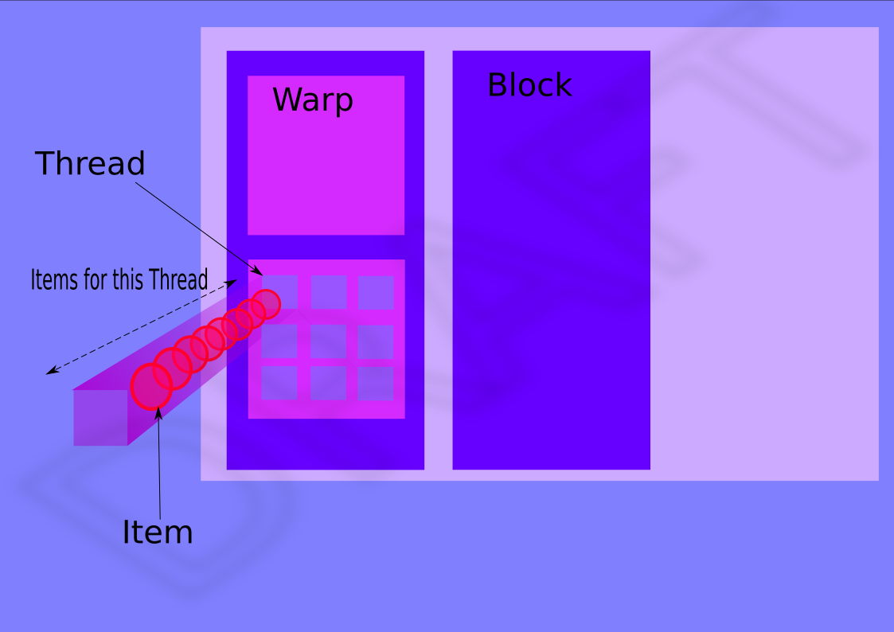

Introduction
============

Operations and Sequences
------------------------

A ``rocPRIM`` operation is a computation over a sequence of objects returning one value (eg ``sum``) , another sequence (eg ``sort``) or multiple sequences (eg ``partition``). The elements of sequence could be of any type or class, although template specialisation allows ``rocPRIM`` to optimise the computations over the usual numerical datatypes. Operations handle sequences by expecting ``iterators`` as input and mutable ones as output.

A high level view of the available operations could be consulted there: :doc:`/operations`. As you can see, those are really generic operations that are difficult to avoid on a day to day basis.

Scope
-----

An important property of a ``rocPRIM`` operation is its scope defining at which level of the computing model the processing will take place. That means which part of the GPU will cooperate together to compute the result.
The scope has a direct influence on how the data will be subdivided into chunks to be eventually processed by the computing units or VALUs.

* *Device/Grid* the operation and data will be split and dispatched to all the CUs.
* :term:`Block` The operation should take place within the same block by the same CU.
* :term:`Warp` as above but with a warp and a VALU.
* *Thread* The operation will take place sequentially in the same thread. We also call those thread-wide operations *Utilities* since it perfectly coincides to utility functions we use on a CPU.

   Computing hierarchy of a GPU

The scope has an impact on how the operation is initiated:

* *Device/Grid* it is a kernel, thus it is dispatched with its own grid/block dimensions.
* *Block/Wrap/Thread* it is a function call, and inherits the dimensions of the current kernel.

This point dictates how synchronization should be done to wait for completion:

* *Device/Grid* Synchronization is done via wait lists and queue barriers (``stream``).
* *Block/Wrap/Thread* it is in the same control flow of the callee threads. Synchronization is done via memory barriers.

